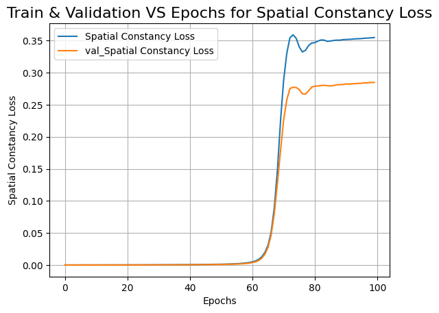
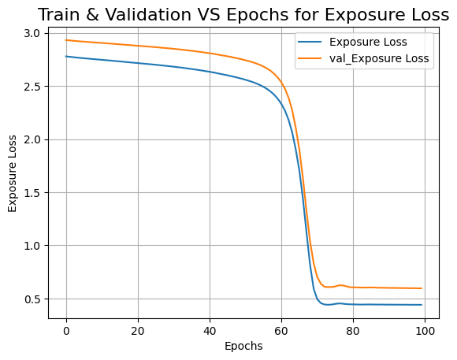
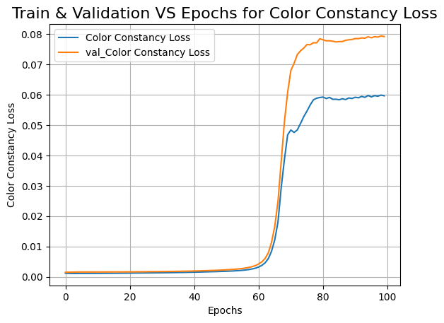
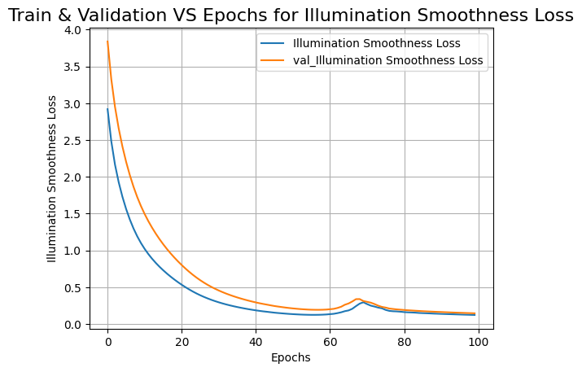
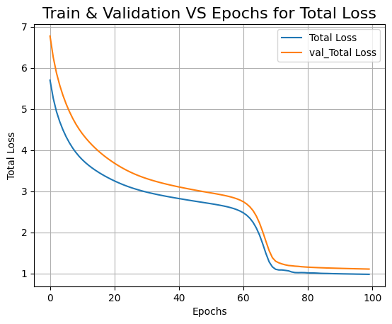
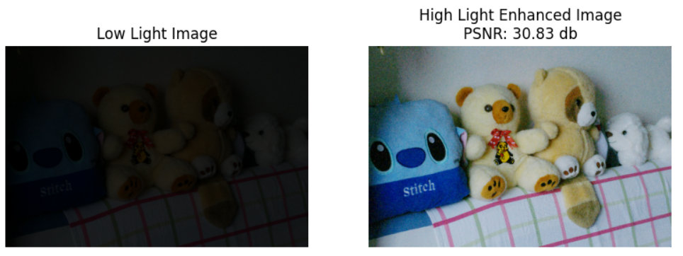

# Low-light Image Enhancement

## Introduction

The project "Low-light Image Enhancement" implements the Zero-Reference Deep Curve Estimation (Zero-DCE) model. Zero-DCE is designed to enhance low-light images by estimating the optimal curve for adjusting image illumination without the need for reference images.

## Zero-DCE Architecture

Zero-DCE is a lightweight convolutional neural network (CNN) designed to enhance low-light images through an end-to-end trainable deep neural network. It uses a deep curve estimation approach, where a set of best-fitting curves are predicted to adjust pixel intensities for improved illumination.

### Key Specifications

- **Model Type**: Convolutional Neural Network (CNN)
- **Layers**: The model consists of multiple convolutional layers followed by non-linear activations to learn the mapping from low-light to enhanced images.
- **Loss Functions**: A combination of spatial consistency loss, exposure control loss, color constancy loss, and illumination smoothness loss is used.
- **Framework**: Implemented in Keras with a TensorFlow backend.
- **PSNR Value**: The Peak Signal-to-Noise Ratio (PSNR) achieved by the model varies depending on the dataset but is competitive with state-of-the-art methods.

### Reference Paper

The project is based on the paper "Zero-Reference Deep Curve Estimation for Low-Light Image Enhancement" by Chunle Guo. The paper can be accessed [here](https://arxiv.org/abs/2001.06826).

## Project Details

This project contains the implementation of the Zero-DCE model using Keras. The notebook includes sections for data loading, model building, training, and evaluation. Below, I provide an overview of the processes, their purposes, and relevant visualizations.

### Importing Libraries

The first step involves importing essential libraries such as TensorFlow/Keras for building and training the neural network, NumPy for numerical operations, and Matplotlib for visualizing results.

### Data Loading

Images are loaded and pre-processed to ensure they are in the correct format and size for the model. Preprocessing typically includes resizing images to a standard size, normalizing pixel values, and converting them to the appropriate data type for input into the neural network.

- **Dataset**: There are a total of 486 low-light and high-light images. Out of these, 350 images are used to train the model, 100 images are used to validate the model, and the remaining images are used for testing the model. We’ve used a batch size of 64.

### Model Building - Deep Curve Estimation (DCE) Network

The Zero-DCE model is constructed using several convolutional layers. These layers are designed to capture different levels of features in the images. The initial layers typically capture low-level features such as edges and textures, while the deeper layers capture more complex patterns and structures.

The convolutional layers are followed by non-linear activation functions, which introduce non-linearity into the model and enable it to learn more complex mappings from input images to enhanced images. The final layer of the model outputs the enhanced image, which is then compared to the ground truth image during training.

### Loss Functions

- **Color Constancy Loss**: Ensures color balance by minimizing the differences between the mean RGB values of the enhanced image.
- **Exposure Loss**: Controls the level of enhancement to achieve a target mean intensity, calculated as the mean squared difference between pooled mean intensity and target mean intensity.
- **Illumination Smoothness Loss**: Promotes smooth transitions of illumination across adjacent pixels, measured by the sum of squared differences between adjacent pixels.
- **Spatial Consistency Loss**: Ensures that the spatial structure of the image is preserved, measured by the sum of squared differences in the spatial differences between the original and enhanced images.

### Zero-DCE Model

- **Compilation**: The model is compiled using the Adam optimizer with a specified learning rate. Spatial consistency loss is initialized as an instance of `SpatialConsistencyLoss`.
- **Image Enhancement**: Enhances input data using the outputs from the DCE network, splitting the output into multiple components and iteratively enhancing data based on element-wise operations.
- **Training Step**: Computes gradients of the total loss with respect to trainable weights and updates weights using the optimizer based on computed gradients.
- **Testing**: Performs a forward pass through the model to get outputs and computes losses during testing.

### Training

Training the model involves compiling it with an optimizer and a loss function, and then fitting it to the training data. The optimizer updates the model's weights based on the gradients of the loss function with respect to the weights. The loss function measures the difference between the predicted and ground truth images, guiding the optimizer in minimizing this difference. The training process includes monitoring the loss values over epochs. In our model, we’ve used 100 epochs.

### Diagrams and Graphs for Different Losses

- **Spatial Consistency Loss**:
  
- **Exposure Loss**:
  
- **Color Constancy Loss**:
  
- **Illumination Smoothness Loss**:
  
- **Total Loss**:
  

## Evaluation and Enhancement

After training, the model is used to enhance low-light images. The evaluation process involves comparing the enhanced images to the original low-light images and calculating metrics such as PSNR (Peak Signal-to-Noise Ratio) to quantify the improvement in image quality.

- **PSNR Values**: The average PSNR value in our results is around 28 dB.

In testing, the trained model produces outputs like the following:

## Summary

In this project, we implemented the Zero-DCE model to enhance low-light images. The model utilizes a deep learning approach to estimate enhancement curves, significantly improving the illumination of images without needing reference images. The Zero-DCE model estimates light enhancement curves (LE-curves) to improve image quality iteratively.

### Methods to Further Improve the Project

1. **Data Augmentation**: Enhancing the training dataset with more variations of low-light conditions can improve the model's robustness and performance.
2. **Hyperparameter Tuning**: Techniques such as grid search or random search can be used to systematically explore different hyperparameter settings.
3. **Advanced Loss Functions**: Incorporating more sophisticated loss functions or a combination of losses tailored for low-light enhancement can further improve image quality.
4. **Real-time Processing**: Optimizing the model for real-time image enhancement, potentially using techniques like model quantization or pruning, can make the model more practical for real-world applications.
5. **Cross-Validation**: Implementing cross-validation ensures the model's generalizability and helps avoid overfitting, leading to more reliable performance across different datasets.
